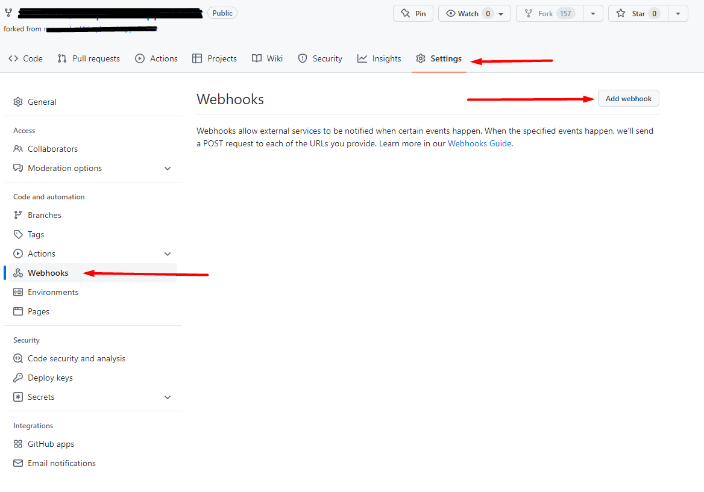
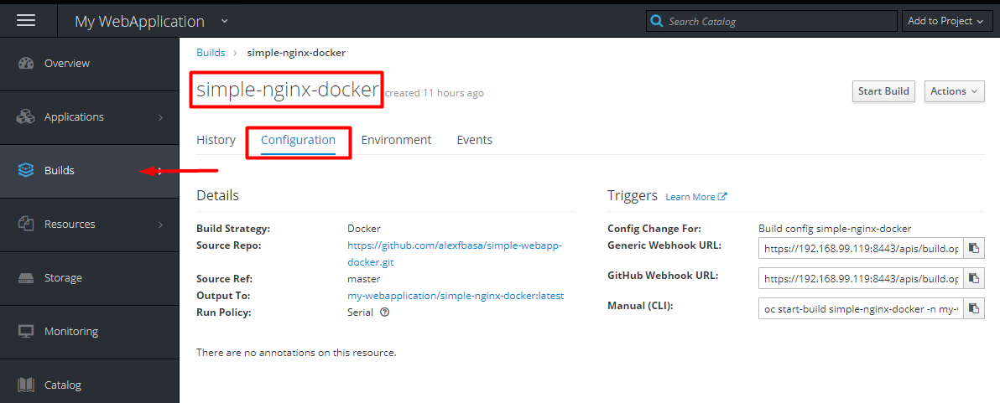
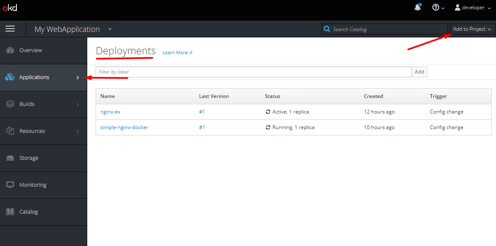
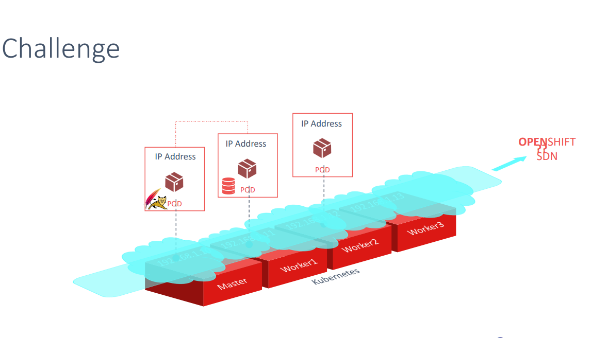
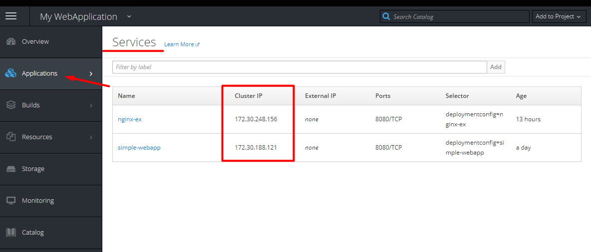
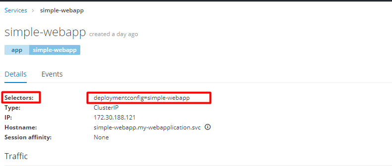
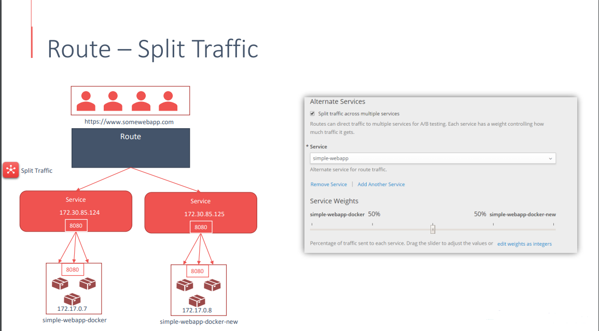

# About okd

Openshift templates example

https://github.com/openshift/origin/tree/master/examples

conectar no console by token

Openshift uses Projects

oc project - check with project you are using
oc new-project myproject - to create a new project
oc project otherproject - swich the project
oc projects - list all the projects available 

## Documentation 

```commandline
oc explain
```

## Common commands

oc status

# Get Pod Documentation

# Get built-in documentation for Pods

oc explain pod

# Get details on the pod's spec

oc explain pod.spec

# Get details on the pod's containers

oc explain pod.spec.containers

# Creating Pods from files

Create a Pod on OpenShift based on a file

```commandline
cd labs/
oc create -f pods/pod.yaml
oc get pods // checar pods rodando
oc rhs hello-world-po // Acesso shell a pod
```

[pod_heello_world](../images/img9.png)

Show all currently running Pods

oc get pods

Watch live updates to pods

oc get pods --watch

## Port forwarding for Pods

Open a local port that forwards traffic to a pod

oc port-forward <pod name> <local port>:<pod port>

Example of 8080 to 8080 for hello world
Crie duas pods:

oc create -f pods/pod.yaml && oc create -f pods/pod2.yaml

Create a pod based on a file (just like the Pods section)
oc create -f pods/pod.yaml

## Services - Create a service for the pod

## Isso ira expor o servico para conexao entre as pods

oc expose --port 8080 pod/hello-world-pod

Check that the service and pod are connected properly
oc status

Create another pod
oc create -f pods/pod2.yaml

Shell into the second pod
oc rsh hello-world-pod-2

Get the service IP and Port
oc status - Para mostrar enderecos de IP e Portas internas

In the shell, you can make a request to the service (because you are inside the OpenShift cluster)
wget -qO- <service IP / Port>

env - Mostrar as variaveis de uma POD
wget -qO- $VARIABLE

Use the environment variables with wget
wget -qO- $HELLO_WORLD_POD_PORT_8080_TCP_ADDR:$HELLO_WORLD_POD_PORT_8080_TCP_PORT

svc/hello-world-pod - 172.30.215.212:8080
svc/hello-world-pod-2 - 172.30.133.110:8080

Shell into Pods
oc rsh will work with any Pod name from oc get pods

oc rsh <pod name> {{pod - com porta exposta}}

# In the shell, check the API on port 8080

wget localhost:8080

# Exposing a Route

Para criar suas proprias entrandas para exposicao externa suas aplicacoes

oc new-app quay.io/practicalopenshift/hello-world --as-deployment-config
oc status

```text
svc/hello-world - 172.30.217.68:8080
  dc/hello-world deploys istag/hello-world:latest
    deployment #1 running for 6 seconds - 1 pod
```

oc expose svc/hello-world

```text
route.route.openshift.io/hello-world exposed
```

oc status

```text
http://hello-world-myproject.192.168.99.123.nip.io to pod port 8080-tcp (svc/hello-world)
dc/hello-world deploys istag/hello-world:latest
deployment #1 deployed 3 minutes ago - 1 pod
```

```text
$ curl http://hello-world-myproject.192.168.99.123.nip.io
Welcome! You can change this message by editing the MESSAGE environment variable.
```

## Para pegar o arquivo YAML

oc get -o yaml route

"" Usar para pegar as rotas do servidor ""
```text
  spec:
    host: hello-world-myproject.192.168.99.123.nip.io  -- DNS Externo
    port:
```
oc get -o yaml service
oc get -o yaml pod/hello-world-pod

# Watch live updates to pods

oc get pods --watch

# Delete (stop) Pods

# Delete any OpenShift resource

oc delete <resource type> <resource name>

# Delete the pod for this section

oc delete pod hello-world-pod

Login

```commandline
oc login -u system:admin
curl -k https://192.168.99.118:8443/oapi/v1/projects -H "Authorization: Bearer
{{TOKEN}}}}"
```

oc new-project
oc new-app
oc

# Get built-in documentation for Pods

oc explain pod

# Get details on the pod's spec

oc explain pod.spec

# Get details on the pod's containers

oc explain pod.spec.containers

# You can use this oc explain command to get info about any of the other fields in a Pod

Esse usuario nao tem permissao no console, ele nao loga
Para criar um usuario adm, voce tem que logar no console web do Openshift com esse usuario
Assim ele sera criado
'''
oc login -u system:admin
oc get users
'''

Agora de permissao

'''
oc adm policy add-cluster-role-to-user cluster-admin "usuario"

oc adm policy add-cluster-role-to-user cluster-admin admin
Saida = clusterrole.rbac.authorization.k8s.io/cluster-admin added: "admin"

'''

# Criar uma configuracao de build

## Deploymentconfig

Define um template para uma pod e gerencia o deploymente de novas imagens ou mudancas de configuracoes.
Uma simples configuracao de deploymente eh normalmente uma analogia a um micro-service.
Pode suportar muitos diferente deploymentes, completa reinicializacao, customizacao de rolling updates,
and completa customizacao de comportamento e tambem pre and post deploymente hooks.
Um deploymente eh engatilhado quando uma configuracao, tag ou ImageStream eh mudada.

### Criar um deployment config vindo de uma inagem

#### Deploy an existing image based on its tag

oc new-app <image tag>

#### Criando o template

oc new-app quay.io/practicalopenshift/hello-world

oc new-app quay.io/practicalopenshift/hello-world --as-deployment-config

Criando um template nomeado
Set the name using the --name flag

oc new-app <image tag> --name <desired name>

oc new-app quay.io/practicalopenshift/hello-world --name demo-app

The specifier will match your desired name (dc/demo-app in this case)

oc describe dc/demo-app

Agora para rodar essa nova configuracao

oc new-app quay.io/practicalopenshift/hello-world --name demo-app --as-deployment-config
oc new-app quay.io/practicalopenshift/hello-world --name demo-app2 --as-deployment-config

[dois_deployments](/images/img12.png)

oc delete all -l app=name demo-app

Rodando container direto repositorio

# Deploy from Git using oc new-app

oc new-app <git repo URL>

# For this lesson

oc new-app https://gitlab.com/practical-openshift/hello-world.git --as-deployment-config

# Follow build progress

oc logs -f bc/hello-world -- bc = build config -- mostrar os logs da construcao da imagem

# Check status and pods

oc status
oc get pods

oc get -o yaml dc/hello-world - Checar o YAML da pod

oc get rc -- checar replica das pods

## Rollou and Roolback version das aplicacoes

oc new-app quay.io/practicalopenshift/hello-world -- iniciar a pod
oc get pods --watch -- para monitorar

# Roll out the latest version of the application

oc rollout latest dc/hello-world

# Roll back to the previous version of the application

oc rollback dc/hello-world

##### Check running resources

oc status
[status_container](/images/img11.png)

##### Check pods

oc get pods
[image_pod](/images/img10.png)

oc get svc - service
oc get dc - deploymente config
oc get istag - ImageStream tag

Para apagar tem que usar o comando completo

oc delete svc/hello-world - servico
oc delete dc/hello-world
oc delete istag/hello-world

oc describe dc/hello-world

Apagando tudo

oc delete all -l app=hello-world

## Services

criar pod atraves de arquivo
oc create -f pod.yaml
oc expose --port 8080 pod/hello-world-pod

Primeiro tem que criar a configuracao de build.
A build construira a imagem e carregara o codigo dentro da imagem

Siga o exemplo em

[ngix_example](/yaml-files/new-build-configuration-example.yaml)

Va em build e importe essa configuracao.
Voce pode rodar essa build manualmente.

S2I pegara o codigo e jogara dentro da imagem

O Status ficara invalid-output-reference - Porque estamos usamo a new-image-stream-tag

E a imagem-stream-tag ainda nao foi criada

Va no arquivo de configuracao de build

[ngix_example](/yaml-files/new-build-configuration-example.yaml)

```yaml
  output:
    to:
      kind: ImageStreamTag
      name: 'simple-nginx-docker:latest'
```

Criar uma new Image-stream-tag - copie no nginx (aplicacao) criado:

Builds -> Image Streams - Clique na imagem -> editar YAML, example:

```yaml
apiVersion: image.openshift.io/v1
kind: ImageStream
metadata:
  name: simple-nginx-docker

```

Cheque se sua build esta rodando!
[img.png](../images/img.png)

# Trigger Build

Webhook - Tecnica de notificacao de eventos usando o requests http.
Toda vez que alguma alteracao for feita, o git notifica e o openshift roda o deploy


Criar o link



Atencao se o github for local, tem que adicionar o regra no git local para aceitar conexao

# Deployment

Imagem Docker criada + codigo integrado
Deployment pega a imagem criar junto com o codigo da aplicacao e publica no cluster
Siga o exemplo:

[deploy-configuratio](../yaml-files/new-nginx-deploy-configuratio.yaml)

Edite - copie - importe as configuracoes


# Openshift SDN

Openshift utiliza o SND para prover e gerenciar as conexoes/comunicacao de rede das podes



Criando Virtual Networks - Overlay Network -> Default IP range - 10.128.0.0/14
Todas as PODs nesses NODES - tem seu IP e Subrede

NODE 1 NODE 2 NODE 3
10.128.0.0/23 10.128.2.0/23 10.128.4.0/23
WEB APP POD1 DATABASE APP POD1 APP 3 POD1
10.128.0.6 10.128.2.2 10.128.4.?

Para checar o IP

```commandline
og get pods -o wide
```

Conectar via IP nao eh boa idea porque pode mudar

## Openshift DNS Service - SDN Plugins

Open vSwitch - Interconect virtual machin e Hypervisor

- VLAN Tagging
- Trunking
- LACP
- Port Mirroring

Ajudar o a utilizar POD name ou services Internos

- ovs-subnet - prove conectividade de rede entre as PODS
- ovs-multitenant - Previne POD se comunicarem, criando uma unico ID de Rede virtual

Outro Plugins de rede

- nuagenetworks
- Contiv
- flannel

## Openshift Comunicacao Externa

Services e Routes

Service - ajuda a conectar diferente aplicacoes ou grupos de PODs uma com as outras, ao inves de utilizar
IP ou DNS, eh recomendado utilizar services para se conectarem.
Service acessam o Load-Balancer
Front-end fala com o Back-end - Service
Back-end fala com o Banco de dados - Service
Front-end expoe os servicos para usuario finais - Service
Banco de Dados Interno - Banco de Dados Externo - Service

Cada Service tem seu IP e DNS
Cada service tem seu Interno IP assinado- 172.17.0.7 - chamado de Cluster IP



Como o Service e lincado com a POD -> Usando selector
Selector sao criados atraves do Docker deployment.
"=nome-do-docker"

Tambem especifica a porta para escutar
Service Porta
E a porta para requiscao -- Target Port

Mas essa porta so eh mapeada na comunicacao interna

Para usuario externo - usa o hostname www.somewebapp.com atraves de uma rota

Rotas:

- Load Balance
- Seguranca
- Split Traffic

Load Balance
Source - Tem a certeza o usuario sempre vai acessar o mesmo back-end service pela direcao
RoundRobin - Cada requisacao e enviada por um caminho diferente, mesmo sendo do mesmo IP e ao mesmo tempo
leastcoon - Escolhe o caminha mais rapido

Segurancao
Prove as definicoes de certificado, tambem definicoes para permitir conexao insegura ou redirect
Certificados e privados keys

Split Traffic
Permiti voce dividir o trafego em dois, supondo que voce tem um ambiente A e B.


# Expondo a aplicacao para os Usuario

Criaremos um Service - como no exemplo [service-conf](../yaml-files/new-nginx-service-configuration.yaml)

```yaml service
apiVersion: v1
kind: Service
metadata:
  name: simple-nginx-docker  //nome do container
spec:
  selector:
  ## Pegue o nome do deployment config label em service
    deploymentconfig: simple-nginx-docker
  ## IP sera adicionado automaticamente, remova linha a baixo
  {{{ clusterIP: 172.30.136.123  }}}
  ## Porta que esta configurado na aplicacao 
  ports:
  - name: 8080-tcp
    port: 8080
    protocol: TCP
    targetPort: 8080
```

Copie e cole criando um novo servico.
Lembre-se que isso eh acesso interno.
Na tela de Service da nova aplicacao, crie uma nota rota no Link.

Se deixar o nome em branco o proprio cluster criara um nome.
Nessa parte seria aonde voce colocaria seu DNS configurado externamente.
Aqui sao as configuracao de redirects, podem ser fonecidas por um YAML

Conceito muito importante que eh sobre multiplas PODS, mesmo com varias PODS a mesma instancia

ROUTE -> STICK - checar configuracao

Por padrao Openshift implemente seu balanceamento.
Para alterar isso:
Routes - Aplicacao - Action - Edit YAML:

adicione=

```yaml
...
metadata:
  annotations:
    haproxy.router.openshift.io/balance: roundrobin
    haproxy.router.openshift.io/disable_cookies: 'true'

```

## ConfigMap
Quando voce deploy sua aplicacao em diferente ambientes 
Para ambiente local voce deveria usar
```text
                 Environments
                    Development     Production
REST API SERVER     localhost       example-api.com
Database            locahost        db-host.internal.com
```

Creating ConfigMaps

Create a ConfigMap using literal command line arguments
oc create configmap message-map --from-literal MESSAGE="Hello From configMap"
oc get configmap  -- mostra o config map criado
oc get -o yaml cm/message-map
```text
apiVersion: v1
data:
  MESSAGE: Hello From configMap
kind: ConfigMap
metadata:
  creationTimestamp: "2022-07-06T10:23:37Z"
  name: message-map
  namespace: myproject
  resourceVersion: "31499"
  selfLink: /api/v1/namespaces/myproject/configmaps/message-map
  uid: b2ccc62d-fd15-11ec-9ac2-0800277dfd8f
```

oc create configmap <configmap-name> --from-literal KEY="VALUE"

Create from a file
oc create configmap <configmap-name> --from-file=MESSAGE.txt

Verify
oc get -o yaml configmap/<configmap-name>


Create from a file with a key override
oc create configmap <configmap-name> --from-file=MESSAGE=MESSAGE.txt

Same --from-file but with a directory
oc create configmap <configmap-name> --from-file pods

Consuming ConfigMaps as Environment Variables

Set environment variables (same for all types of ConfigMap)
oc set env dc/hello-world --from cm/<configmap-name>
oc set env dc/hello-world --from cm/message-map
curl http://hello-world-myproject.192.168.99.123.nip.io
Hello From configMap

oc get -o yaml dc/hello-world  // pegar o deployment configuratio
```text
  - env:
        - name: MESSAGE
          valueFrom:
            configMapKeyRef: 
              key: MESSAGE
              name: message-map  --> Qual o configmap usado

```
```commandline
echo "Hello from configMap file" > MESSAGE.txt
oc create configmap file-map --from-file=MESSAGE.txt
configmap/file-map created
oc get -o yaml configmap/file-map
```
```text
apiVersion: v1                                              
data:                                                       
  MESSAGE.txt: |                --> WRONG KEY VALUE                                        
    Hello from configMap file   --> MESSAGE                            
kind: ConfigMap                                             
metadata:                                                   
  creationTimestamp: "2022-07-06T22:08:04Z"                 
  name: file-map                                            
  namespace: myproject                                      
  resourceVersion: "201819"                                 
  selfLink: /api/v1/namespaces/myproject/configmaps/file-map
  uid: 1bd72e17-fd78-11ec-9ac2-0800277dfd8f  
```
```commandline
oc create configmap file-map-2 --from-file=MESSAGE=MESSAGE.txt
```
```text
apiVersion: v1
data:
  MESSAGE: |                    --> RIGHT KEY VALUE
    Hello from configMap file
kind: ConfigMap
metadata:
  creationTimestamp: "2022-07-06T22:12:14Z"
  name: file-map-2
  namespace: myproject
  resourceVersion: "202825"
  selfLink: /api/v1/namespaces/myproject/configmaps/file-map-2
  uid: b09e2aa2-fd78-11ec-9ac2-0800277dfd8f

```
```commandline
oc set env dc/hello-world --from cm/file-map-2
oc status  --> Pegar endereco da rota e acessar a pagina
```
Criando configmap por diretorio 

```commandline
cd labs
oc create configmap pods-example --from-file pods  --> todos os arquivo yaml de config e cria um map
oc get -o yaml configmap/pods-example
```

## Secrets
Armazenar privada informacoes
- Credenciais
- Certificados
- Keys
- Informacao de autenticacao
- Autorizacao
- Seguraca

Creating Secrets

Create a simple generic (Opaque) Secret
oc create secret generic <secret-name> --from-literal KEY="VALUE"

Check the Secret
oc get -o yaml secret/<secret-name>


Consume the Secret as Environment Variables

Almost the same as ConfigMaps
oc set env dc/<dc-name> --from secret/<secret-name>

Create a simple generic (Opaque) secret
oc create secret generic message-secret --from-literal MESSAGE="Secret Message"

Check the existing Secrets
oc get secret

Check our new Secret
oc get -o yaml secret/message-secret


oc create: ConfigMap vs. Secret
```text
                      Kind                      Name
ConfigMap = oc create configmap                 message-map --from-literal MESSAGE="Hello From ConfigMap"
                      Kind   Type of Secret     Name
Secret    = oc create secret    generic         message-secret --from-literal MESSAGE="Secret Text"
```
```commandline
oc get -o yaml secret/message-secret
```
```text
apiVersion: v1
data:
  MESSAGE: U2VjcmV0IFRleHQ=
kind: Secret
metadata:
  creationTimestamp: "2022-07-06T23:29:25Z"
  name: message-secret
  namespace: myproject
  resourceVersion: "221541"
  selfLink: /api/v1/namespaces/myproject/secrets/message-secret
  uid: 795006af-fd83-11ec-9ac2-0800277dfd8f
type: Opaque
```

## ImageStreams

List ImageStreams
oc get is

Delete ImageStreams
oc delete is/hello-world

Create ImageStreams

Create the ImageStream (but don't deploy yet)
oc import-image --confirm <image tag>

Example with this course's image
oc import-image --confirm quay.io/practicalopenshift/hello-world

Importing any new images
oc import-image --confirm quay.io/practicalopenshift/hello-world


Importing extra ImageStreamTags for an existing ImageStream

oc tag syntax
oc tag <original> <destination>

Example
oc tag quay.io/image-name:tag image-name:tag

Check the current ImageStreams and ImageStreamTags

List tags
oc get istag


Use the ImageStream with oc new-app

Deploy an application based on your new ImageStream
oc new-app myproject/hello-world

oc tag syntax
oc tag <original> <destination>

Example
oc tag quay.io/image-name:tag image-name:tag

This lesson
oc tag quay.io/practicalopenshift/hello-world:update-message hello-world:update-message

Check your ImageStreams
oc get is

Check your ImageStreamTags
oc get istag

## Importando imagens privadas para o projeto
echo $REGISTRY_USERNAME
source credentials.env  --> popular as variaveis

Remote Tag syntax
<host name>/<your username>/<image name>

Load environment variables from credentials.env
source credentials.env

Building an image with a remote tag
docker build -t quay.io/$REGISTRY_USERNAME/private-repo .

Enviando a imagem para o repositorio 
Log into a registry
docker login <hostname>

Log into quay.io
docker login quay.io

Push (send) an image to a remote registry
docker push <remote tag>

Push the image to Quay
docker push quay.io/$REGISTRY_USERNAME/private-repo

The command to import the private image (won't work without extra auth steps)
oc new-app quay.io/$REGISTRY_USERNAME/private-repo

You may need to run this command
source credentials.env

Create a Docker registry secret
oc secrets link default demo-image-pull-secret --for=pull   --> First  Maybe

oc describe serviceaccount/default

The same image from the start should work now
oc new-app quay.io/$REGISTRY_USERNAME/private-repo

oc create secret docker-registry \
demo-image-pull-secret \
--docker-server=$REGISTRY_HOST \
--docker-username=$REGISTRY_USERNAME \
--docker-password=$REGISTRY_PASSWORD \
--docker-email=$REGISTRY_EMAIL

A touch of secrets magic
This command links the secret to the service account named "default"
oc secrets link default demo-image-pull-secret --for=pull

Check that the service account has the secret associated
oc describe serviceaccount/default


